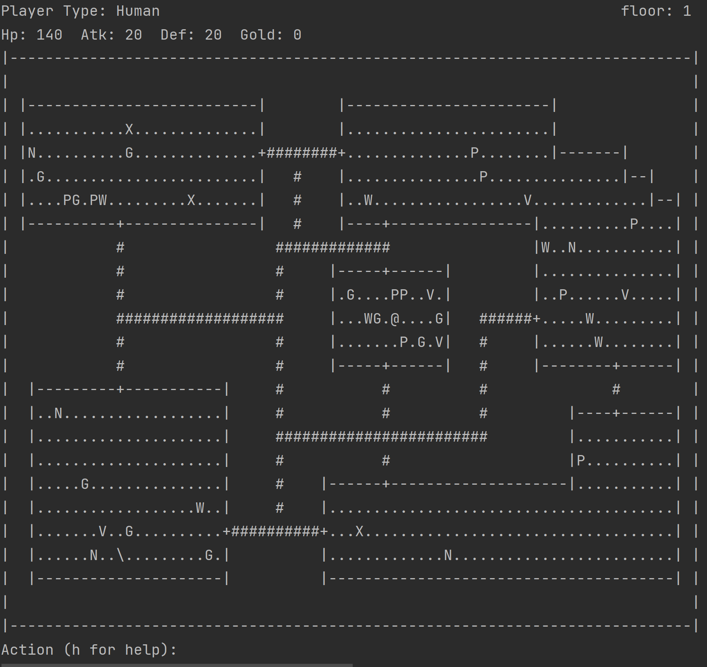

# Dungeon Crawler
This is an ascii art video game where you enter commands to make things happen.

## Requirements
* [Java Run Time Environment](https://www.java.com/en/)
* A keyboard

## Choose your Fantasy Race
When you start the program you will be greeted with your first option:
What fantasy race you would like to play as. Select a race by typing the 
first letter of its name. For example, if you want to be a human 
you can type "h" without the quotations and press enter.

## Map
You will then be shown the dungeon map. You are the @ symbol in the
center of the image below. Above the map are your characters stats.

"Action (h for help):" is where you type in your commands

## Goal
Survive all levels 5 levels of the dungeon. Each level has a staircase
represented by a slash (/). Walking over the slash will bring you to 
the next level. 

The fifth and final level has a dollar sign ($) instead of a slash. 
Walking over this will win you the game.

## Move
You can move by using these commands:
* no -- Walk **north** one character
* ne -- Walk **north-east** one character
* ea -- Walk **east** one character
* se -- Walk **south-east** one character
* so -- Walk **south** one character
* sw -- Walk **south-west** one character
* we -- Walk **west** one character
* nw -- Walk **north-west** one character

**Important Note: you can repeat the last action by pressing enter without
typing anything. This is very useful for travelling long distances in one
direction.**

## Symbol Legend
Each character on the map represents a different game piece. The meaning of
each character is described below.

### Walkable Tiles
* "." -- Room Tile
* "+" -- Doorway
* "#" -- Hallway Tile

### Non-Walkable Tiles
* " " -- Empty Space
* "-", "|" -- Wall Tiles

### Enemies
* "D" -- Dragon
* "X" -- Phoenix
* "M" -- Merchant
* "N" -- Goblin
* "T" -- Troll
* "W" -- Werwolf
* "V" -- Vampire

### Misc
* " \ " -- Staircase
* "@" -- Player Character (You)
* "P" -- Potion
* "G" -- Gold

## Attack
To attack an enemy they must be within a one character radius of you.
Use the following command:

a *direction*

For example:
* a no -- attack something north of you
* a se -- attack something south-east of you

To repeat an attack at the same location press enter without typing 
anything.

## Use Potions
To use a potion, type:

u *direction*

For exmaple:
* u we -- use a potion west of you
* u ne -- use a potion north-east of you
